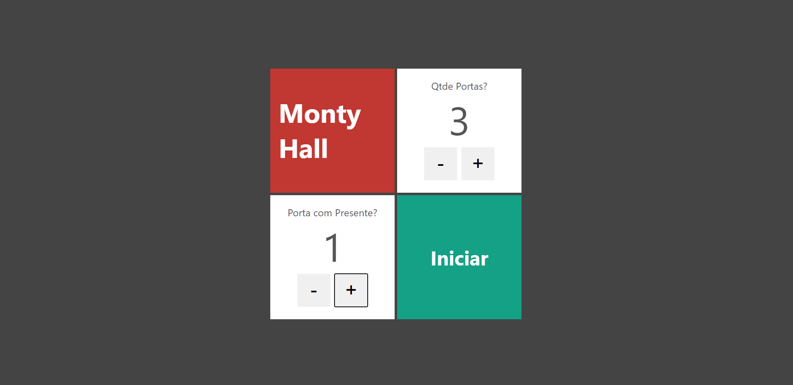
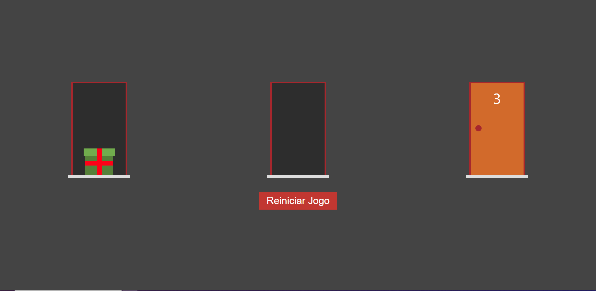

<h1 align="center">
    Monty Hall
</h1>

<p align="center">
 <a href="#-sobre-o-projeto">Sobre</a> •
 <a href="#-funcionalidades">Funcionalidades</a> •
 <a href="#-layout">Layout</a> • 
 <a href="#-como-executar-o-projeto">Como executar</a> • 
 <a href="#-tecnologias">Tecnologias</a>
</p>

## 💻 Sobre o projeto

O projeto é baseado no paradoxo de Monty Hall é um problema matemático e paradoxo que surgiu a partir de um concurso televisivo dos Estados Unidos chamado Let’s Make a Deal, exibido na década de 1970.

O jogo consiste em um usuário escolher uma quantidade X de portas e posteriormente, escolher 1 para colocar o presente, outro usuário tenta adivinhar em qual porta está o presente.

---

## ⚙️ Funcionalidades

- [x] O usuário pode escolher a quantidade de portas que ele deseja jogar entre 3 e 100.

- [x] O usuário escolhe em qual porta está o presente.

- [x] Podemos selecionar e abrir todas as portas.

---

## 🎨 Layout

O layout da aplicação:

### Web

<p align="center" style="display: flex; align-items: flex-start; justify-content: center;">

## Home

  

## Jogo

  

## 🚀 Como executar o projeto

Este projeto possui apenas FrontEnd.

### Pré-requisitos

Antes de começar, você vai precisar ter instalado em sua máquina as seguintes ferramentas:
[Git](https://git-scm.com), [Node.js](https://nodejs.org/en/).

Além de um editor de código como o [VSCode](https://code.visualstudio.com/).

#### 🎲 Rodando a Aplicação Web (Frontend)

```bash
# Clone este repositório
$ https://github.com/RenatoAlbuquerque/MontyHall.git
# Acesse a pasta do projeto no terminal/cmd
$ cd MontyHall
# Instale as dependências
$ npm install
# Execute a aplicação
$ npm start
# A aplicação iniciará na porta:3000 - acesse http://localhost:3000
```

---

## 🛠 Tecnologias

#### **Website** ([Next](https://vercel.com/solutions/nextjs))

- **[Typescript](https://www.typescriptlang.org/)**

> Veja o arquivo [package.json](https://github.com/RenatoAlbuquerque/MontyHall/blob/main/package.json)


